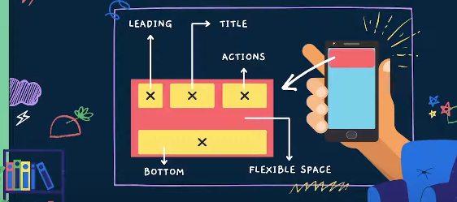

# AppBar

`AppBar` Mempunyai flow atau cara kerja seperti ini

* **Dokumentasi**
  * [AppBar Documentation](https://api.flutter.dev/flutter/material/AppBar-class.html)

---

[Date Format](../date_formater/README.md) <> [TabBar](../tabs/README.md)
