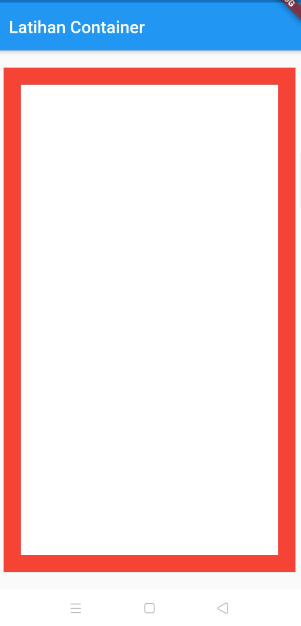
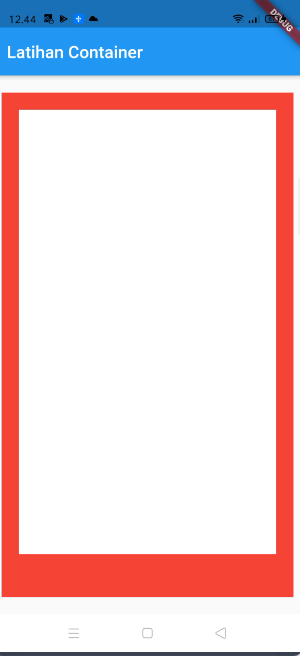
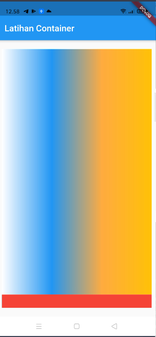

### Container


salah satu widget dasar yang sering digunakan untuk membuat Aplikasi dengan flutter adalah `Container` yang biasa digunakan untuk

### Properti yang sering digunakan

* margin
* padding
* Decoration

**Margin**

margin adalah jarak antara `Container` dengan widget lain nya(*yang diluar `Container`*)

contoh penggunaan nya seperti ini

```dart
/// Home Page
class Home extends StatelessWidget {
  const Home({ Key? key }) : super(key: key);

  @override
  Widget build(BuildContext context) {
    return Scaffold(
      appBar: AppBar(title: Text('Latihan Container'),),
      body: Container(
        color: Colors.red,
        margin: EdgeInsets.all(20),
      ),
    );
  }
}
```

jika dijalankan asilnya jadi ada djarak seoerti ini


yang sebelumnya seperti ini

```dart
/// Home Page
class Home extends StatelessWidget {
  const Home({ Key? key }) : super(key: key);

  @override
  Widget build(BuildContext context) {
    return Scaffold(
      appBar: AppBar(title: Text('Latihan Container'),),
      body: Container(
        color: Colors.red,
      ),
    );
  }
}
```


**Padding**

padding adalah jarak dari sisi `Container` ke widget yang ada dalam `Container`

contoh seperti ini

```dart
class Home extends StatelessWidget {
  const Home({ Key? key }) : super(key: key);

  @override
  Widget build(BuildContext context) {
    return Scaffold(
      appBar: AppBar(title: Text('Latihan Container'),),
      body: Container(
        margin: EdgeInsets.all(20),
        padding: EdgeInsets.all(20),
        color: Colors.red,
        child: Container(
          color: Colors.white,
        ),
      ),
    );
  }
}
```

maka hasilnya seperti ini


**Padding dan Margin**

kita juga dapat membalikan seperti ini

```dart
class Home extends StatelessWidget {
  const Home({ Key? key }) : super(key: key);

  @override
  Widget build(BuildContext context) {
    return Scaffold(
      appBar: AppBar(title: Text('Latihan Container'),),
      body: Container(
        margin: EdgeInsets.all(20),
        color: Colors.red,
        child: Container(
          margin: EdgeInsets.all(20),
          color: Colors.white,
        ),
      ),
    );
  }
}
```

atau seperti ini

```dart
class Home extends StatelessWidget {
  const Home({ Key? key }) : super(key: key);

  @override
  Widget build(BuildContext context) {
    return Scaffold(
      appBar: AppBar(title: Text('Latihan Container'),),
      body: Container(
        padding: EdgeInsets.all(20),
        color: Colors.red,
        child: Container(
          padding: EdgeInsets.all(20),
          color: Colors.white,
        ),
      ),
    );
  }
}
```

hasilnya


### Pasang `Padding` Dan `Margin` Secara Manual

disini kita dapat menentukan padding dan margin secara manual menggunakan `EdgeInsets.fromLTRB`

```dart
class Home extends StatelessWidget {
  const Home({ Key? key }) : super(key: key);

  @override
  Widget build(BuildContext context) {
    return Scaffold(
      appBar: AppBar(title: Text('Latihan Container'),),
      body: Container(
        margin: EdgeInsets.fromLTRB(10, 20, 10, 20),
        color: Colors.red,
        child: Container(
          margin: EdgeInsets.all(20),
          color: Colors.white,
        ),
      ),
    );
  }
}
```

hasilnya



kita bisa juga menentukan secara spesifik sisi yang kita ubah menggunakan `EdgeInsets.only()` seperti ini

```dart
class Home extends StatelessWidget {
  const Home({ Key? key }) : super(key: key);

  @override
  Widget build(BuildContext context) {
    return Scaffold(
      appBar: AppBar(title: Text('Latihan Container'),),
      body: Container(
        margin: EdgeInsets.fromLTRB(10, 20, 10, 20),
        padding: EdgeInsets.only(bottom: 30),
        color: Colors.red,
        child: Container(
          margin: EdgeInsets.all(20),
          color: Colors.white,
        ),
      ),
    );
  }
}
```


hasilnya



**Decoration**

property ini biasa digunakan buat mendekorasi widget `Container` yang kita punya contoh

```dart
class Home extends StatelessWidget {
  const Home({Key? key}) : super(key: key);

  @override
  Widget build(BuildContext context) {
    return Scaffold(
      appBar: AppBar(
        title: Text('Latihan Container'),
      ),
      body: Container(
        margin: EdgeInsets.fromLTRB(10, 20, 10, 20),
        padding: EdgeInsets.only(bottom: 30),
        color: Colors.red,
        child: Container(
          decoration: BoxDecoration(
              gradient: LinearGradient(colors: <Color>[
            Colors.white,
            Colors.blue,
            Colors.orangeAccent,
            Colors.amber
          ])),
        ),
      ),
    );
  }
}
```

hasilnya kaya gini




**Menentukan Arah Gradasi**

untuk menentukan arah gradasr kita bisa menotak atik `BoxDecoration` contoh

```dart
class Home extends StatelessWidget {
  const Home({Key? key}) : super(key: key);

  @override
  Widget build(BuildContext context) {
    return Scaffold(
      appBar: AppBar(
        title: Text('Latihan Container'),
      ),
      body: Container(
        margin: EdgeInsets.fromLTRB(10, 20, 10, 20),
        padding: EdgeInsets.only(bottom: 30),
        color: Colors.red,
        child: Container(
          decoration: BoxDecoration(
            
              gradient: LinearGradient(
                begin: Alignment.topCenter,
                end: Alignment.bottomCenter,
                colors: <Color>[
            Colors.white,
            Colors.blue,
            Colors.orangeAccent,
            Colors.amber
          ])),
        ),
      ),
    );
  }
}
```

hasilnya


**menentukan BorderRadius**

kita bisa membuat lengkungan ,menggunakan border radius contoh

```dart
class Home extends StatelessWidget {
  const Home({Key? key}) : super(key: key);

  @override
  Widget build(BuildContext context) {
    return Scaffold(
      appBar: AppBar(
        title: Text('Latihan Container'),
      ),
      body: Container(
        margin: EdgeInsets.fromLTRB(10, 20, 10, 20),
        padding: EdgeInsets.only(bottom: 30),
        color: Colors.red,
        child: Container(
          decoration: BoxDecoration(
              borderRadius: BorderRadius.circular(30),
              gradient: LinearGradient(
                begin: Alignment.topCenter,
                end: Alignment.bottomCenter,
                colors: <Color>[
            Colors.white,
            Colors.blue,
            Colors.orangeAccent,
            Colors.amber
          ])),
        ),
      ),
    );
  }
}
```

hasilnya


sampai sini dulu materi kali ini explore lagi di dokumentasi di bawah

### Kode Lengkap

kode lengkapnya seperti ini

```dart
import 'package:flutter/material.dart';

void main() {
  runApp(MyApp());
}

class MyApp extends StatelessWidget {
  const MyApp({Key? key}) : super(key: key);

  @override
  Widget build(BuildContext context) {
    return MaterialApp(
      home: Home(),
    );
  }
}

/// Home Page
class Home extends StatelessWidget {
  const Home({Key? key}) : super(key: key);

  @override
  Widget build(BuildContext context) {
    return Scaffold(
      appBar: AppBar(
        title: Text('Latihan Container'),
      ),
      body: Container(
        margin: EdgeInsets.fromLTRB(10, 20, 10, 20),
        padding: EdgeInsets.only(bottom: 30),
        color: Colors.red,
        child: Container(
          decoration: BoxDecoration(
              borderRadius: BorderRadius.circular(30),
              gradient: LinearGradient(
                begin: Alignment.topCenter,
                end: Alignment.bottomCenter,
                colors: <Color>[
            Colors.white,
            Colors.blue,
            Colors.orangeAccent,
            Colors.amber
          ])),
        ),
      ),
    );
  }
}
```

### Referensi dan Sumber Belajar


* [Dokumentasi Container Widget](https://api.flutter.dev/flutter/widgets/Container-class.html)

* [channel belajar tentang container](https://www.youtube.com/watch?v=inlgWTc0Pb4&list=PLZQbl9Jhl-VACm40h5t6QMDB92WlopQmV&index=7)
---

[Row Dan Column]() <> [Stateless vs Statefull Widget]()