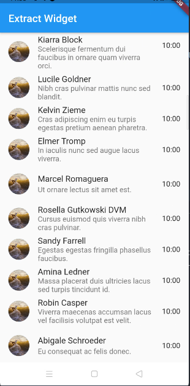

## Extract Widget

`extract widget` digunakan untuk mengekstract widget yang sudah kita kustomisasi misalnya seperti ini

```dart
ListTile(
    leading: CircleAvatar(
    backgroundImage: NetworkImage(imageUrl),
    ),
    title: Text(title),
    subtitle: Text(subtitle),
    trailing: Text('10:00'),
);
```

ketika kita refactor maka akan menjadi widget baru seperti ini

```dart
class ChatItem extends StatelessWidget {
  final String imageUrl;
  final String title;
  final String subtitle;

  ChatItem(
      {Key? key,
      required this.imageUrl,
      required this.title,
      required this.subtitle})
      : super(key: key);

  @override
  Widget build(BuildContext context) {
    return ListTile(
      leading: CircleAvatar(
        backgroundImage: NetworkImage(imageUrl),
      ),
      title: Text(title),
      subtitle: Text(subtitle),
      trailing: Text('10:00'),
    );
  }
}
```

kemudian kalo kita terapkan akan jadi seperti ini

```dart
import 'package:faker/faker.dart';
import 'package:flutter/material.dart';

class Home extends StatelessWidget {
  final faker = Faker();

  @override
  Widget build(BuildContext context) {
    return Scaffold(
      appBar: AppBar(
        title: Text('Extract Widget'),
      ),
      body: ListView.builder(
       itemCount: 100,
       itemBuilder: (context, index) {
         return ChatItem(imageUrl: faker.image.image(), title: faker.person.name(), subtitle: faker.lorem.sentence());
       },
      ),
    );
  }
}

class ChatItem extends StatelessWidget {
  final String imageUrl;
  final String title;
  final String subtitle;

  ChatItem(
      {Key? key,
      required this.imageUrl,
      required this.title,
      required this.subtitle})
      : super(key: key);

  @override
  Widget build(BuildContext context) {
    return ListTile(
      leading: CircleAvatar(
        backgroundImage: NetworkImage(imageUrl),
      ),
      title: Text(title),
      subtitle: Text(subtitle),
      trailing: Text('10:00'),
    );
  }
}
```

maka outputnya menjadi seperti ini



### Plugin yang Dipakai

dalam chapter ini terdapat plugin yang dipakai seperti

* [Faker](https://pub.dev/packages/faker)

plugin ini berfungsi untuk menampilkan fake data seperti nama, alamat dan lain nya

#### Dokumentasi

* [Extract Widget Sample Concept](https://www.raywenderlich.com/10126984-creating-reusable-custom-widgets-in-flutter)
* [Faker Documentation](https://pub.dev/documentation/faker/latest/)

---

[List Tile Widget](../list_tiles/README.md) <> [Penggunaan Statefull Widget]()