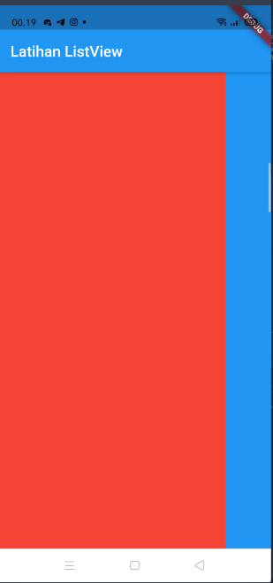
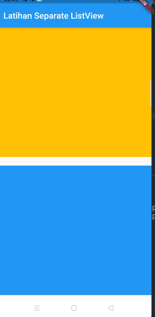

## ListView dan ListView.builder

### ListView

`ListView` biasa digunakan untuk membuat *children* (kumpulan widget) menjadi *Scrollable* atau dapat di scroll

contoh kodenya seperti ini


```dart
import 'package:flutter/material.dart';

class Home extends StatelessWidget {
  const Home({Key? key}) : super(key: key);

  @override
  Widget build(BuildContext context) {
    return Scaffold(
      appBar: AppBar(
        title: Text('Latihan ListView'),
      ),
      body: ListView(
        children: [
          Container(
            height: 300,
            width: 300,
            color: Colors.red,
          ),
          Container(
            height: 300,
            width: 300,
            color: Colors.blue,
          ),
          Container(
            height: 300,
            width: 300,
            color: Colors.green,
          ),
          Container(
            height: 300,
            width: 300,
            color: Colors.amber,
          )
        ],
      ),
    );
  }
}
```


### Beberapa Property yang sering dipakai di ListView

ada beberapa property yang sering dipake di listview diantaranya

* `scrollDirection`


**ScrollDirecction**

contoh kodenya seperti ini

```dart
import 'package:flutter/material.dart';

class Home extends StatelessWidget {
  const Home({Key? key}) : super(key: key);

  @override
  Widget build(BuildContext context) {
    return Scaffold(
      appBar: AppBar(
        title: Text('Latihan ListView'),
      ),
      body: ListView(
        scrollDirection: Axis.horizontal,
        children: [
          Container(
            height: 300,
            width: 300,
            color: Colors.red,
          ),
          Container(
            height: 300,
            width: 300,
            color: Colors.blue,
          ),
          Container(
            height: 300,
            width: 300,
            color: Colors.green,
          ),
          Container(
            height: 300,
            width: 300,
            color: Colors.amber,
          )
        ],
      ),
    );
  }
}
```

outputnya seperti ini



bentuk umum penggunaan `ListView` dapat seperti ini

```dart
import 'package:flutter/material.dart';

/// List of Widget
List<Container> myList = [
  Container(
    height: 300,
    width: 300,
    color: Colors.red,
  ),
  Container(
    height: 300,
    width: 300,
    color: Colors.blue,
  ),
  Container(
    height: 300,
    width: 300,
    color: Colors.green,
  ),
  Container(
    height: 300,
    width: 300,
    color: Colors.amber,
  )
];

class Home extends StatelessWidget {
  const Home({Key? key}) : super(key: key);

  @override
  Widget build(BuildContext context) {
    return Scaffold(
      appBar: AppBar(
        title: Text('Latihan ListView'),
      ),
      body: ListView(
        scrollDirection: Axis.horizontal,
        children: myList,
      ),
    );
  }
}
```

outputnya sama seperti ini


### Oprek lebih dalem

kalo kita perhatikan pada list yang tadi kita buat

```dart
List<Container> myList = [
  Container(
    height: 300,
    width: 300,
    color: Colors.red,
  ),
  Container(
    height: 300,
    width: 300,
    color: Colors.blue,
  ),
  Container(
    height: 300,
    width: 300,
    color: Colors.green,
  ),
  Container(
    height: 300,
    width: 300,
    color: Colors.amber,
  )
];
```
kita tidak dapat menambahkan widget lain selain container kecuali kita ubah tipe data dalam List Menjadi widget seperti ini

```dart
List<Widget> myList = [
  Container(
    height: 300,
    width: 300,
    color: Colors.red,
  ),
  Container(
    height: 300,
    width: 300,
    color: Colors.blue,
  ),
  Container(
    height: 300,
    width: 300,
    color: Colors.green,
  ),
  Container(
    height: 300,
    width: 300,
    color: Colors.amber,
  ),
  Text('Ini adalah Text')
];
```

jika kita jalankan hasilnya seperti ini


kode lengkapnya seperti ini

```dart
import 'package:flutter/material.dart';

/// List of Widget
List<Widget> myList = [
  Container(
    height: 300,
    width: 300,
    color: Colors.red,
  ),
  Container(
    height: 300,
    width: 300,
    color: Colors.blue,
  ),
  Container(
    height: 300,
    width: 300,
    color: Colors.green,
  ),
  Container(
    height: 300,
    width: 300,
    color: Colors.amber,
  ),
  Text('Ini adalah Text')
];

class Home extends StatelessWidget {
  const Home({Key? key}) : super(key: key);

  @override
  Widget build(BuildContext context) {
    return Scaffold(
      appBar: AppBar(
        title: Text('Latihan ListView'),
      ),
      body: ListView(
        scrollDirection: Axis.vertical,
        children: myList,
      ),
    );
  }
}
```

### ListView.builder

`ListView.builder` digunakan untuk membuat list widget secara dinamis, contoh penerapanya seperti ini

```dart
import 'package:flutter/material.dart';

class Homes extends StatelessWidget {
  const Homes({Key? key}) : super(key: key);

  @override
  Widget build(BuildContext context) {
    return Scaffold(
        appBar: AppBar(
          title: Text('Latihan ListView'),
        ),
        body: ListView.builder(
          itemCount: 4,
          itemBuilder: (context, index) {
            return Text('Text ke $index');
          },
        ));
  }
}
```

jika dijalankan maka hasilnya seperti ini


contoh penerapan lain (lebih dinamis seperti ini)

```dart
ListView.builder(
  itemCount: myColor.length,
  itemBuilder: (context, index) {
    return Container(height: 300, width: 300, color: myColor[index]);
  },
)
```

jika kita jalankan maka seperti ini


kode lengkapnya seperti ini

```dart
import 'package:flutter/material.dart';

List<Color> myColor = [Colors.amber, Colors.blue, Colors.red];

class Homes extends StatelessWidget {
  const Homes({Key? key}) : super(key: key);

  @override
  Widget build(BuildContext context) {
    return Scaffold(
        appBar: AppBar(
          title: Text('Latihan ListView'),
        ),
        body: ListView.builder(
          itemCount: myColor.length,
          itemBuilder: (context, index) {
            return Container(height: 300, width: 300, color: myColor[index]);
          },
        ));
  }
}
```

#### Property yang sering dipake di `ListView`

ada beberapa property yang bisa dipake di listView salah satunya adalah

**ListView.separated**

ini digunakan untuk membatasi atau memberi jarak pada widget

contoh kode sepetri ini

```dart
import 'package:flutter/material.dart';

List<Color> myColor = [Colors.amber, Colors.blue, Colors.red];

class SeparatorView extends StatelessWidget {
  const SeparatorView({Key? key}) : super(key: key);

  @override
  Widget build(BuildContext context) {
    return Scaffold(
      appBar: AppBar(
        title: Text('Latihan Separate ListView'),
      ),
      body: ListView.separated(
        itemCount: myColor.length,
        itemBuilder: (context, index) {
          return Container(
            width: 300,
            height: 300,
            color: myColor[index],
          );
        },
        separatorBuilder: (context, index) {
          return Divider(
            height: 20,
          );
        },
      ),
    );
  }
}
```

hasilnya seperti ini



**List.generate**

kita bisa generate sebuah list secara otomatis misalnya seperti ini

```dart
import 'package:flutter/material.dart';

/// generate widget
List<Widget> listOfText = List.generate(100, (index) {
  return Text('Text Nomor: $index');
});

class ListGeneratorView extends StatelessWidget {
  const ListGeneratorView({Key? key}) : super(key: key);

  @override
  Widget build(BuildContext context) {
    return Scaffold(
      appBar: AppBar(
        title: Text('ListGenerator'),
      ),
      body: ListView.builder(
        itemCount: listOfText.length,
        itemBuilder: (context, index) {
          return Container(
            child: listOfText[index],
          );
        },
      ),
    );
  }
}
```

hasilnya seperti ini


sampai disini dulu materi kali ini 

---

[Visible dan Invisible Widget](../visible_invisible_widget/README.md) <> [ListTile]()