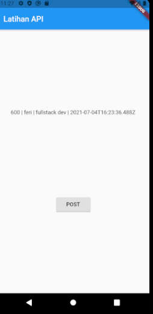

### Bekerja dengan API di Flutter

untuk bekerja degan API atau berkomunikasi dengan API kita perlu 3 hal wajib

1. Membuat Class Model
2. Membuat Factory Method (*digunakan untuk me mapping JSON object tadi ke Class Model yang dibuat*)
3. Method untuk Memanggil API

contoh membuat Model

```dart
// post_result_model.dart

class PostResult {
  String? id;
  String? name;
  String? job;
  String? created;

  // constructor
  PostResult({this.id, this.name, this.job, this.created});
}
```

jadi dimana nanti yang dimasukan parameternya langsung dimasukan ketdalam `field` nya secara otomatis

langkah selanjutnya membuat sebuah `factory method` fungsinya untuk membuat object dari **PostResult**
tapi dia membuat objectnya bertdasarkan hasil Mapping dari `JSON Object` API nya

ketika kita lihat response object dari API nya

```json
{
    "name": "morpheus",
    "job": "leader",
    "id": "31",
    "createdAt": "2021-07-04T12:53:52.368Z"
}
```

dapat kita lihat bahwa response API tersebut memiliki 3 key

* `name`
* `job`
* `id`
* `createdAt`

dan request yang dibutuhkan

```json
{
    "name": "morpheus",
    "job": "leader"
}
```

maka kita buat factory sesuai response dari API misalnya seperti ini

### Post Method

```dart
// factory function
factory PostResult.createPostResult(Map<String, dynamic> jsonObject) {
return PostResult(
  id: jsonObject['id'],
  name: jsonObject['name'],
  job: jsonObject['job'],
  created: jsonObject['createdAt']
);
}
```

kemudian kita buat method untuk memanggil dan mengolah API

```dart
// connect to API method
  static Future<PostResult>connectToAPI(String name, String job) async {
    // api URL
    var apiUrl = Uri.parse("https://reqres.in/api/users");

    // api request to get response
    var apiResult = await http.post(apiUrl, body: {"name": name, "job": job});

    // get json data
    var jsonObjectDecode = json.decode(apiResult.body);

    // return json Object Post Result
    return PostResult.createPostResult(jsonObjectDecode);
}
```

kode lengkapnya seperti ini

```dart
import 'dart:convert';

import 'package:http/http.dart' as http;

class PostResult {
  String? id;
  String? name;
  String? job;
  String? created;

  // constructor
  PostResult({this.id, this.name, this.job, this.created});

  // factory function
  factory PostResult.createPostResult(Map<String, dynamic> jsonObject) {
    return PostResult(
        id: jsonObject['id'],
        name: jsonObject['name'],
        job: jsonObject['job'],
        created: jsonObject['createdAt']);
  }

  // connect to API method
  static Future<PostResult>connectToAPI(String name, String job) async {
    // api URL
    var apiUrl = Uri.parse("https://reqres.in/api/users");

    // api request to get response
    var apiResult = await http.post(apiUrl, body: {"name": name, "job": job});

    // get json data
    var jsonObjectDecode = json.decode(apiResult.body);

    // return json Object Post Result
    return PostResult.createPostResult(jsonObjectDecode);
  }
}
```

atau bisa juga seperti ini


```dart
class PostResult {
  final String? id;
  final String? name;
  final String? job;
  final String? created;

  // constructor
  PostResult({this.id, this.name, this.job, this.created});

  // factory function
  factory PostResult.createPostResult(Map<String, dynamic> jsonObject) {
    return PostResult(
        id: jsonObject['id'],
        name: jsonObject['name'],
        job: jsonObject['job'],
        created: jsonObject['createdAt']);
  }

  // connect to API method
  static Future<PostResult>connectToAPI(String? name, String? job) async {
    // api URL
    var apiUrl = Uri.parse("https://reqres.in/api/users");

    // api request to get response
    var apiResult = await http.post(apiUrl, body: {"name": name, "job": job});

    // get json data
    var jsonObjectDecode = json.decode(apiResult.body);

    // return json Object Post Result
    return PostResult.createPostResult(jsonObjectDecode);
  }
```


#### Menerapkan Pada Main Project

untuk menerapkanya pada project kita cukup panggil modelnya seperti ini

```dart
PostResult? postResult;
```

kemudian kita pake di widget

```dart
Text((postResult != null)
      ? postResult!.id.toString() +
          ' | ' +
          postResult!.name.toString() +
          ' | ' +
          postResult!.job.toString() +
          ' | ' +
          postResult!.created.toString()
      : 'tidak ada tdata'),
  RaisedButton(
    onPressed: () {
      PostResult.connectToAPI('feri', 'fullstack dev')
          .then((value) => postResult = value);
      setState(() {});
    },
    child: Text("POST"),
  ),
```

kode lengkap main

```dart
import 'package:flutter/material.dart';
import 'package:simple_api/post_result_model.dart';

void main() {
  runApp(MyApp());
}

class MyApp extends StatefulWidget {

  @override
  _MyAppState createState() => _MyAppState();

}


class _MyAppState extends State<MyApp> {
  // call model
  PostResult? postResult;

  @override
  Widget build(BuildContext context) {
    return MaterialApp(
      home: Scaffold(
        appBar: AppBar(
          title: Text("Latihan API"),
        ),
        body: Center(
          child: Column(
            mainAxisAlignment: MainAxisAlignment.spaceEvenly,
            children: [
              Text((postResult != null)
                  ? postResult!.id.toString() +
                      ' | ' +
                      postResult!.name.toString() +
                      ' | ' +
                      postResult!.job.toString() +
                      ' | ' +
                      postResult!.created.toString()
                  : 'tidak ada tdata'),
              RaisedButton(
                onPressed: () {
                  PostResult.connectToAPI('feri', 'fullstack dev')
                      .then((value) => postResult = value);
                  setState(() {});
                },
                child: Text("POST"),
              ),
            ],
          ),
        ),
      ),
    );
  }
}
```




### GET Method

pada bahasan sebelumnya kita sudah membuat tentang `POST` method

kita buat model baru berdasarkan mapping json nya

```json
{
    "data": {
        "id": 2,
        "email": "janet.weaver@reqres.in",
        "first_name": "Janet",
        "last_name": "Weaver",
        "avatar": "https://reqres.in/img/faces/2-image.jpg"
    },
    "support": {
        "url": "https://reqres.in/#support-heading",
        "text": "To keep ReqRes free, contributions towards server costs are appreciated!"
    }
}
```

disini kita ambil `id`, `first_name`, `last_name` kemudian kita buat modelnya `user_model` dimana isi dari model adalah 

```dart
class UserModel {
  final String? id;
  final String? name;

  // constructor
  UserModel({this.id, this.name});
```

patokan untuk membuat model tersebut adalah nilai yang mau diambil dari *Response API nya*

contoh disini menmabil `id` dan `name` aja

kemudian kita membuat `factory method` untuk casting dan parsing json object dan bisa diolah di aplikasi
flutter kita

```dart
// factory method
factory UserModel.createUser(Map<String, dynamic> object) {
  return UserModel(
      id: object['id'],
      name: object['first_name'] + ' ' + object['last_name']);
}
```

kemudian kita perlu method untuk request ke API nya kan

```dart
// get json object and store to model method
static Future<UserModel> connectToAPI(String id) async {
  // API URL
  String apiURL = "https://reqres.in/api/users/" + id;
  var getResult = await http.get(Uri.parse(apiURL));
  var jsonObject = json.decode(getResult.body);

  // casting `data` value
  var getUserData = (jsonObject as Map<String, dynamic>)['data'];

  // return value
  return UserModel.createUser(getUserData);
}
```

dapat kita lihat bahwa response dari API nya

```json
{
    "data": {
        "id": 2,
        "email": "janet.weaver@reqres.in",
        "first_name": "Janet",
        "last_name": "Weaver",
        "avatar": "https://reqres.in/img/faces/2-image.jpg"
    },
    "support": {
        "url": "https://reqres.in/#support-heading",
        "text": "To keep ReqRes free, contributions towards server costs are appreciated!"
    }
}
```

dimana `data` ada object lagi maka perlu kita casting seperti ini

```dart
// casting `data` value
var getUserData = (jsonObject as Map<String, dynamic>)['data'];

// return value
return UserModel.createUser(getUserData);
```

kemudian di return maka si user Model akan dapat seperti ini

```json
"data": {
        "id": 2,
        "email": "janet.weaver@reqres.in",
        "first_name": "Janet",
        "last_name": "Weaver",
        "avatar": "https://reqres.in/img/faces/2-image.jpg"
},
```

lengkapnya

```dart
import 'dart:convert';

import 'package:http/http.dart' as http;

class UserModel {
  final String? id;
  final String? name;

  // constructor
  UserModel({this.id, this.name});

  // factory method
  factory UserModel.createUser(Map<String, dynamic> object) {
    return UserModel(
        id: object['id'].toString(),
        name: object['first_name'] + ' ' + object['last_name']);
  }

  // get json object and store to model method
  static Future<UserModel> connectToAPI(String id) async {
    // API URL
    String apiURL = "https://reqres.in/api/users/" + id;
    var getResult = await http.get(Uri.parse(apiURL));
    var jsonObject = json.decode(getResult.body);

    // casting `data` value
    var getUserData = (jsonObject as Map<String, dynamic>)['data'];

    // return value
    return UserModel.createUser(getUserData);
  }
}

```

kemudian kita terapkan di main seperti ini

```dart
class _MyAppState extends State<MyApp> {
  // call model
  PostResult? postResult;
  UserModel? userModel;

  @override
  Widget build(BuildContext context) {
    return MaterialApp(
      home: Scaffold(
        appBar: AppBar(
          title: Text("Latihan API"),
        ),
        body: Center(
          child: Column(
            mainAxisAlignment: MainAxisAlignment.spaceEvenly,
            children: [
              Text((userModel != null)
                  ? userModel!.id.toString() +
                      ' | ' +
                      userModel!.name.toString() +
                      ' | ' +
                      postResult!.job.toString() +
                      ' | ' +
                      postResult!.created.toString()
                  : 'tidak ada tdata'),
              RaisedButton(
                onPressed: () {
                  UserModel.connectToAPI('feri')
                      .then((value) => userModel = value);
                  setState(() {});
                },
                child: Text("GET"),
```

lengkapnya seperti ini

```dart
import 'package:flutter/material.dart';
import 'package:simple_api/post_result_model.dart';
import 'package:simple_api/user_model.dart';

void main() {
  runApp(MyApp());
}

class MyApp extends StatefulWidget {
  @override
  _MyAppState createState() => _MyAppState();
}

class _MyAppState extends State<MyApp> {
  // call model
  PostResult? postResult;
  UserModel? userModel;

  @override
  Widget build(BuildContext context) {
    return MaterialApp(
      home: Scaffold(
        appBar: AppBar(
          title: Text("Latihan API"),
        ),
        body: Center(
          child: Column(
            mainAxisAlignment: MainAxisAlignment.spaceEvenly,
            children: [
              Text((userModel != null)
                  ? userModel!.id.toString() +
                      ' | ' +
                      userModel!.name.toString()
                  : 'tidak ada data'),
              RaisedButton(
                onPressed: () {
                  UserModel.connectToAPI('1')
                      .then((value) => userModel = value);
                  setState(() {});
                },
                child: Text("GET"),
              ),
            ],
          ),
        ),
      ),
    );
  }
}
```

maka hasilnya


### Koneksi ke API dengan Kumpulan Data

sekarang gimana klo apinya terdiri dari banyak data misalnya

```json
{
    "page": 2,
    "per_page": 6,
    "total": 12,
    "total_pages": 2,
    "data": [
        {
            "id": 7,
            "email": "michael.lawson@reqres.in",
            "first_name": "Michael",
            "last_name": "Lawson",
            "avatar": "https://reqres.in/img/faces/7-image.jpg"
        },
        {
            "id": 8,
            "email": "lindsay.ferguson@reqres.in",
            "first_name": "Lindsay",
            "last_name": "Ferguson",
            "avatar": "https://reqres.in/img/faces/8-image.jpg"
        },
        {
            "id": 9,
            "email": "tobias.funke@reqres.in",
            "first_name": "Tobias",
            "last_name": "Funke",
            "avatar": "https://reqres.in/img/faces/9-image.jpg"
        },
        {
            "id": 10,
            "email": "byron.fields@reqres.in",
            "first_name": "Byron",
            "last_name": "Fields",
            "avatar": "https://reqres.in/img/faces/10-image.jpg"
        },
        {
            "id": 11,
            "email": "george.edwards@reqres.in",
            "first_name": "George",
            "last_name": "Edwards",
            "avatar": "https://reqres.in/img/faces/11-image.jpg"
        },
        {
            "id": 12,
            "email": "rachel.howell@reqres.in",
            "first_name": "Rachel",
            "last_name": "Howell",
            "avatar": "https://reqres.in/img/faces/12-image.jpg"
        }
    ],
    "support": {
        "url": "https://reqres.in/#support-heading",
        "text": "To keep ReqRes free, contributions towards server costs are appreciated!"
    }
}
```

nah bisa kita lihat bahwa

isi dari `data` itu berupa `Map` dari json object

```json
"data": [
        {
            "id": 7,
            "email": "michael.lawson@reqres.in",
            "first_name": "Michael",
            "last_name": "Lawson",
            "avatar": "https://reqres.in/img/faces/7-image.jpg"
        },
        {
            "id": 8,
            "email": "lindsay.ferguson@reqres.in",
            "first_name": "Lindsay",
            "last_name": "Ferguson",
            "avatar": "https://reqres.in/img/faces/8-image.jpg"
        },
        {
            "id": 9,
            "email": "tobias.funke@reqres.in",
            "first_name": "Tobias",
            "last_name": "Funke",
            "avatar": "https://reqres.in/img/faces/9-image.jpg"
        },
        {
            "id": 10,
            "email": "byron.fields@reqres.in",
            "first_name": "Byron",
            "last_name": "Fields",
            "avatar": "https://reqres.in/img/faces/10-image.jpg"
        },
        {
            "id": 11,
            "email": "george.edwards@reqres.in",
            "first_name": "George",
            "last_name": "Edwards",
            "avatar": "https://reqres.in/img/faces/11-image.jpg"
        },
        {
            "id": 12,
            "email": "rachel.howell@reqres.in",
            "first_name": "Rachel",
            "last_name": "Howell",
            "avatar": "https://reqres.in/img/faces/12-image.jpg"
        }
    ],
```

untuk mengaksesnya kita perlu buat method baru

contoh method nya seperti ini


###### Package yang digunakan
* https://pub.dev/packages/http

