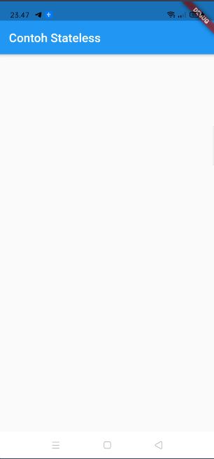
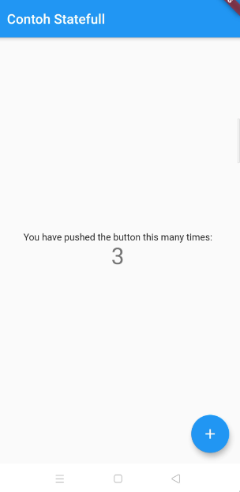

## Stateful vs Stateless Widget

dalam flutter terdapat beberapa widget dasar seperti `Stateless Widget` dan `Statefull Widget` berikut bahasan nya 


### Stateless Widget

`Stateless Widget` adalah sebuah widget (aplikasi) yang tidak memerlukan state / keadaan 

### Stateful Widget

`Stateful Widget` adalah sebuah widget (aplikasi) yang memerlukan perubahan state/ keadaan
jadi adalah kebalikan dari `Stateless Widget`

### Kapan Kita Menggunakan Stateless atau Stateful widget

muncul pertanyaan ketika kita sedang memoelajari flutter yaitu kapan kita harus menggunakan 
`Stateless` atau `Stateful` widget, jawabnya adalah ketika kita membuat sebuah screen yang memerlukan perubahan state kita membutuhkan `Stateful Widget` namun jika tidak kita menggunakan `stateless`

> Note: kita bisa juga melakukan perubahan pada `Stateless Widget` dengan menggunakan
> [`State Management`](https://flutter.dev/docs/development/data-and-backend/state-mgmt/simple)

**Contoh Stateless Widget**

contoh sederhana menggunakan screen/pages yang menggunakan `Stateless Widget` 

```dart
import 'package:flutter/material.dart';
import 'package:states/pages/home.dart';

void main() {
  runApp(MyApp());
}

class MyApp extends StatelessWidget {
  // This widget is the root of your application.
  @override
  Widget build(BuildContext context) {
    return MaterialApp(
      title: 'Flutter Demo',
      theme: ThemeData(
        primarySwatch: Colors.blue,
      ),
      home: Scaffold(appBar: AppBar(title: Text('Contoh Stateless'),),),
    );
  }
}
```

hasilnya seperti ini




**Contoh Stateful Widget**

seperti yang sudah dibahas sebelumnya `Stateful Widget` adalah widget yang bisa diubah-ubah nilainya contoh kita buat file namanya `home.dart` untuk mencontohkan nya

```dart
import 'package:flutter/material.dart';

class MyHomePage extends StatefulWidget {
  MyHomePage({Key? key, required this.title}) : super(key: key);

  final String title;

  @override
  _MyHomePageState createState() => _MyHomePageState();
}

class _MyHomePageState extends State<MyHomePage> {
  int _counter = 0;

  void _incrementCounter() {
    setState(() {
      _counter++;
    });
  }

  @override
  Widget build(BuildContext context) {
    return Scaffold(
      appBar: AppBar(
        title: Text(widget.title),
      ),
      body: Center(
        child: Column(
          mainAxisAlignment: MainAxisAlignment.center,
          children: <Widget>[
            Text(
              'You have pushed the button this many times:',
            ),
            Text(
              '$_counter',
              style: Theme.of(context).textTheme.headline4,
            ),
          ],
        ),
      ),
      floatingActionButton: FloatingActionButton(
        onPressed: _incrementCounter,
        tooltip: 'Increment',
        child: Icon(Icons.add),
      ), // This trailing comma makes auto-formatting nicer for build methods.
    );
  }
}
```

lalu dalam main kita coba import

```dart
import 'package:flutter/material.dart';
import 'package:states/pages/home.dart';

void main() {
  runApp(MyApp());
}

class MyApp extends StatelessWidget {
  // This widget is the root of your application.
  @override
  Widget build(BuildContext context) {
    return MaterialApp(
      title: 'Flutter Demo',
      theme: ThemeData(
        primarySwatch: Colors.blue,
      ),
      home: MyHomePage(title: 'Contoh Stateful'),
    );
  }
}
```

hasilnya seoerti ini




### State Management

dalam penggunaan `stateful widget` kita akan merender ulang semua widget dalam satu page
kekuranganya aplikasi akan memakan banyak memory akibatnya aplikasi akan menjadi berat, cara mengatasinya menggunakan `State Management` dimana fungsi `State Management` adalah mengubah/SetState widget yang perlu diubah saja tidak perlu render semuanya

#### Jenis State Management

berikut beberapa state management yang banyak digunakan

* [provider](https://pub.dev/packages/provider) -> [sample](https://flutter.dev/docs/development/data-and-backend/state-mgmt/simple)
* [BloC](https://pub.dev/packages/flutter_bloc)
* [GetX](https://pub.dev/packages/get)

itu dia penjelasan singkat mengenai stateless dan statefull widget dan contoh state management

---

[Container Widget](../containers/README.md) <> [Visible dan Invisible Widget]()
