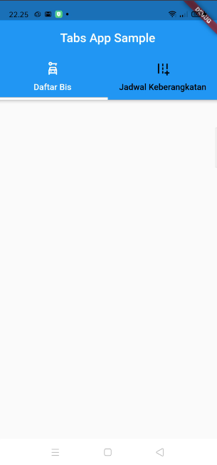

# TabBar

```dart
import 'package:flutter/material.dart';
import 'package:tabs/widgets/home_widget.dart';

class Home extends StatelessWidget {
  const Home({Key? key}) : super(key: key);

  @override
  Widget build(BuildContext context) {
    return DefaultTabController(
      length: listTabBar.length,
      child: Scaffold(
        appBar: AppBar(
          title: Text('Tabs App Sample'),
          centerTitle: true,
          bottom: TabBar(
            tabs: listTabBar,
            unselectedLabelColor: Colors.black,
            indicator: BoxDecoration(
                border:
                    Border(bottom: BorderSide(width: 4, color: Colors.white))),
          ),
        ),
        body: TabBarView(children: [
          Center(child: Text('tab 1')),
          Center(child: Text('Tab 2')),
        ]),
      ),
    );
  }
}
```

hasilnya



* **Dokumentasi**
  * [TabBar](https://api.flutter.dev/flutter/material/TabBar-class.html)

---

[AppBar](../app_bars/README.md) <> [TextField]()